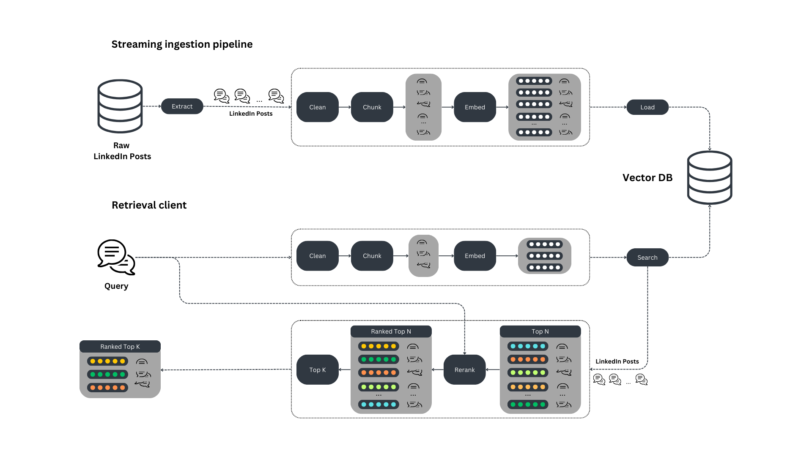
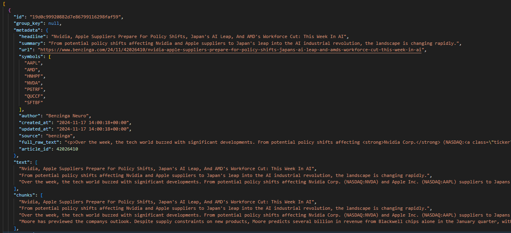
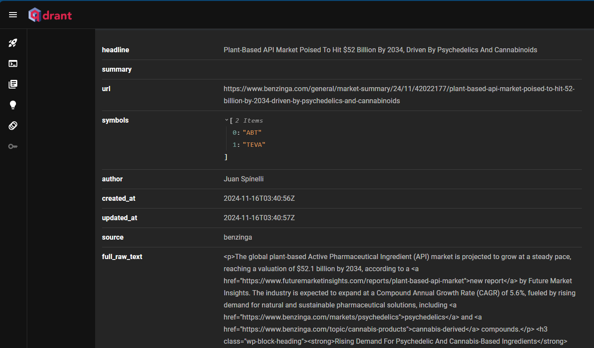
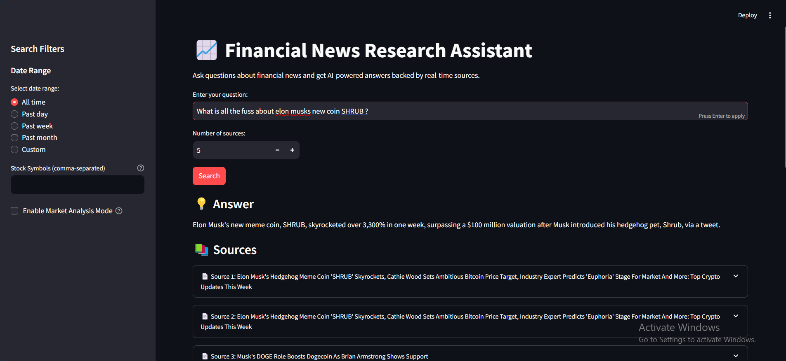
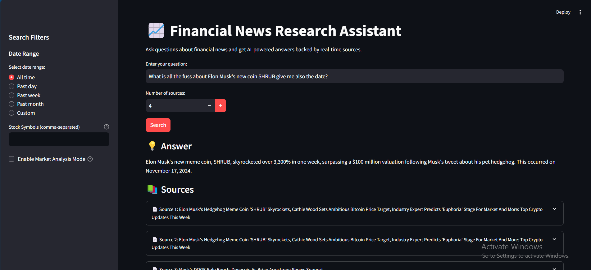
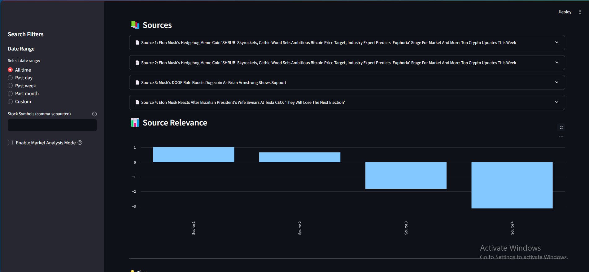

# Real-time Financial News RAG System

A real-time Retrieval Augmented Generation (RAG) system for financial news, featuring streaming data ingestion, vector storage, and an interactive query interface.

## System Architecture




```
┌────────────────────────────┐     ┌──────────────┐     ┌─────────────┐     ┌───────────┐
│  News Sources              │────>│   Bytewax    │────>│   Qdrant    │────>│ LangChain │
│ (Alpaca-Mock/Stream/Batch) │     │  Pipeline    │     │  VectorDB   │     │    RAG    │
└────────────────────────────┘     └──────────────┘     └─────────────┘     └───────────┘
                                                                                  │
                                                                                  v
                                                                          ┌───────────────┐
                                                                          │   Streamlit   │
                                                                          │  Interface    │
                                                                          └───────────────┘
```
## Project Overview

- Build a streaming pipeline that ingests Alpaca Financial News into a vector DB in realtime/near-realtime
- Clean, chunk, and embed News Data 
- Build a retrieval client to query News Data
- Use a rerank pattern to improve retrieval accuracy

### The retrieval system is based on 2 detached components:

- The streaming ingestion pipeline
- The retrieval client

The streaming ingestion pipeline could run 24/7 to keep the vector DB synced up with current News about financials in our data source, depending on which
Data streaming is selected, in our case we have 3 types of data ingestion mechanisms
1. Batch import using dates from and to
2. Real time ingestion using websocket that listens to news articles being sent from alpaca
3. Mock databases which could also be a json file that is capable of providing the same type of data

The retrieval client is used in RAG applications to query the vector DB leveraging langchains easy integration. These 2 components communicate with each other only through the vector DB.

## Chosing stream engine?

Because News data especially financial news evolve frequently, our vector DB can quickly get out of sync. To handle this, we must build a pipeline that runs every minute/second/day. 
But to really minimize data decay and to make sure our vector DB stays current with new events, we need to use a streaming pipeline that immediately takes every new item the moment it's available, 
preprocesses it, and loads it into the vector DB.

### We used Bytewax as our streaming engine more can be found [Here - Official Documentation](https://docs.bytewax.io/stable/guide/getting-started/simple-example.html)

## Why Bytewax?

Bytewax is a streaming engine built in Rust that exposes a Python interface. We use Bytewax because it combines the impressive speed and reliability of Rust with the ease of use and ecosystem of Python
and learning curve is also small, as we needed to optimize for the time we have to prototype. Other streaming engines were also considered such as Kafka, which could be prototyped and integrated later on. On that note, Bytewax also streams events to kafka, we can leverage that and create more robust framework for our pipeline.

## The retrieval client
Our retrieval client is a Qdrant standard Python module that preprocesses user queries and searches the vector DB for most similar results. 
Qdrant vector DB lets us decouple the retrieval client from the streaming ingestion pipeline.

## Data
We have ingested more than 60 news from alpaca to Qdrant Vector Db. the schema looks like this


### Qdrant cloud data used for this prototype can be found [here](https://73bdd42b-86a7-49fc-bcf4-e6bf85cfca17.us-east4-0.gcp.cloud.qdrant.io:6333/dashboard#/collections/alpaca_financial_news) 

Use the below API Key to browse the data and visualize

```python
QDRANT_API_KEY = 'pG-09pBVQTDpHkLVL3b3m_A_nEZLGYg88ew8_wFb5BtkasvGpyHOlQ'
```

## Or in Qdrant Cloud it looks like this


## Bytewax flow
Bytewax enables us to define pipelines as a directed graph called flow, hence we have defined our flow as follows

1. Validate the ingested data
2. Clean the news data
3. Chunk the posts using Attention Window
4. Embed the posts
5. Load the posts to a Qdrant vector DB

# Financial News Freshness Scoring System

## Why This Matters

In financial news, timing is everything. A news article about a stock price movement from yesterday could be completely irrelevant or even misleading today. Our system aims to solve this critical challenge by automatically weighing information based on its age.

## How It Works

Think of our scoring system like a fresh food rating:
- Brand new content (0-4 hours): "Fresh from the oven" - 100% confidence score
- Recent content (4-24 hours): "Still fresh but cooling down" - Gradually decreasing confidence
- Older content (>24 hours): "Past its prime" - Minimal confidence score

### Key Features

1. **Time-Based Scoring**
   - Fresh content (under 4 hours) gets maximum visibility
   - Content gradually "fades" in importance over time
   - Very old content (>24 hours) is marked as potentially outdated

2. **Search Results Impact**
   - Newer content naturally bubbles up to the top
   - Older content requires higher relevance to compete with fresher content
   - System maintains a balance between relevance and freshness

## Planned Integration

Due to time constraints, this system remains at the design stage, but here's how it would integrate into our pipeline:

1. **Document Ingestion**
   - Each incoming news article gets timestamped
   - System calculates initial freshness score

2. **Search Process**
   - When someone searches, freshness scores are factored into rankings
   - Recent, relevant content gets priority over older, slightly more relevant content

3. **Continuous Updates**
   - Scores automatically update as time passes
   - No manual intervention needed

## Benefits

1. **More Relevant Results**
   - Users see the most recent, relevant information first
   - Reduces risk of acting on outdated information


## Next Steps

To implement this system, we would need to:
1. Integrate the scoring system with our current RAG pipeline
2. Set up automated testing with different time scenarios
3. Fine-tune the decay parameters based on user feedback and data gathered adjusting weights
4. Add monitoring for system performance

## Future Enhancements

While the current design focuses on time-based scoring, future versions could include:
- Source credibility weights
- Market hours awareness
- Event-based importance factors such as breaking news
- Geographic relevance adjustments

## Context

This system was designed as part of a technical interview task. While time constraints prevented full implementation, the design demonstrates:
- Understanding of real-time data challenges
- Practical approach to information relevancy
- Scalable solution thinking
- Balance of technical and business needs

## LLM Generation Using Lang Chain
This project utilizes LangChain's latest features for Retrieval Augmented Generation (RAG) with GPT-4o-mini, combining vector similarity search and reranking for accurate financial news analysis.

# LangChain & LLM Integration Guide

## Overview
This project utilizes LangChain's latest features for Retrieval Augmented Generation (RAG) with GPT-4, combining vector similarity search and reranking for accurate financial news analysis.

## Key Features

### 1. Custom Prompting
```python
prompt = ChatPromptTemplate.from_messages([
    ("system", """You are a financial news expert assistant.
    Provide accurate, well-sourced answers based on the given context.
    If information isn't in the context, clearly state that."""),
    ("user", """Context: {context}
    Question: {question}
    Provide a detailed analysis.""")
])
```

### 2. RAG Chain
```python
def _create_chain(self):
    return (
        RunnableParallel(
            {"context": self.retriever | self._format_docs,
             "question": RunnablePassthrough()}
        )
        | self.prompt
        | self.llm
        | StrOutputParser()
    )
```

### 3. Answer Generation
- Context-aware responses
- Source attribution
- Confidence scoring


## Usage Examples

### 1. Basic Query
```python
response = rag_pipeline.query(
    "What was the latest announcement from Apple?",
    temperature=0.2
)
```

### 2. Analysis Query
```python
analysis = rag_pipeline.query(
    "What are the implications of this FDA approval?",
    analysis_mode=True,
    temperature=0.5
)
```

### 3. Filtered Search
```python
filtered_response = rag_pipeline.query_by_filters(
    question="Latest developments?",
    symbols=["AAPL"],
    date_range="1d"
)
```

## Best Practices to implement

1. **Temperature Settings**:
   - Use 0 for factual queries
   - Use 0.3-0.7 for analysis

2. **Context Management**:
   - Limit context to relevant information - we can use time decay for this also
   - Include metadata for better answers - could be feature engineering or classification

3. **Error Handling**:
   - Handle API rate limits
   - Implement fallback options

## Limitations

1. **RAG Challenges**:
   - Context relevance
   - Information freshness
   - Answer accuracy

## Using Reranker

# Cross-Encoder Reranking System Guide

## Overview
The reranking system uses a cross-encoder model to improve vector search results by reranking retrieved documents based on relevance to the query.

## Implementation

### 1. Reranker Architecture
```python
class ArticleReranker:
    """Cross-encoder based reranking system."""
    
    def __init__(
        self,
        cross_encoder_model: CrossEncoderModelSingleton,
        batch_size: int = 32,
        score_threshold: float = 0.5
    ):
        self.cross_encoder_model = cross_encoder_model
        self.batch_size = batch_size
        self.score_threshold = score_threshold
```
# Time Decay reranker alghorithm

## Purpose
The time decay mechanism applies a decay factor to the scores based on the age of the news article. This ensures that more recent articles are prioritized over older ones.

## Implementation
A decay function is applied to the scores, reducing their value as the article's age increases.

## Limitations
- Decay Rate: Choosing the appropriate decay rate can be challenging and may require tuning based on user feedback.
- Relevance: Older articles that are still relevant may be unfairly penalized.

## Agregating Scoring Mechanisms
The Agregating scoring mechanism is used to combine multiple scores into a single, comprehensive score that reflects the overall relevance of a news article. we implemented different agregation mechanism to find one that suits our needs

1. Weighted Average
    - Recent articles are given higher weights to ensure that the information is up-to-date.
    - Limitations: The choice of weights can be subjective and may not reflect the true importance of each factor.
2. Harmonic Mean
    - The harmonic mean is calculated as the reciprocal of the arithmetic mean of the reciprocals of the scores.
    - Limitation: The harmonic mean is highly sensitive to low scores, which can disproportionately affect the overall ranking.
3. Geometric Mean
    - The geometric mean is calculated by taking the nth root of the product of the scores, where n is the number of scores.
    - Limitation: The geometric mean cannot handle zero values, which can be problematic if any score is zero and Less interpretable
4. Rank Fusion
    - is a method for combining scores from different sources by ranking each score type separately and then combining the ranks using weights.

## Integration with RAG System

### 1. In Query Pipeline
```python
class NewsRAGSystem:
    def query(self, question: str):
        # First-stage retrieval
        initial_results = self.retriever.search(question)
        
        # Reranking
        if self.reranker:
            reranked_results = self.reranker.rerank(
                query=question,
                articles=initial_results
            )
            
            # Generate answer using reranked results
            response = self.generate_answer(
                question=question,
                context=self._format_context(reranked_results)
            )
```

### 2. With Filtering
```python
def query_by_filters(
    self,
    query: str,
    symbols: Optional[List[str]] = None,
    date_range: Optional[str] = None
):
    # Get filtered results
    filtered_results = self.retriever.search_by_filters(
        query=query,
        symbols=symbols,
        date_range=date_range
    )
    
    # Apply reranking
    if self.reranker and filtered_results:
        filtered_results = self.reranker.rerank(
            query=query,
            articles=filtered_results
        )
    
    return filtered_results
```

## Project Structure
```
RealTimeRAG/
├── api/                     # Contains API-related code (if applicable).
├── data/
│   ├── documents.json       # Sample data for the knowledge base.
├── experiments/             # Prototyping and experimental scripts.
├── notebooks/               # Jupyter notebooks for analysis and testing.
├── ingestion_pipeline.py    # Data ingestion logic for knowledge base updates.
├── pipeline/
│   ├── base.py              # Base utilities for the RAG pipeline.
│   ├── batch.py             # Batch processing logic.
│   ├── constants.py         # Project-wide constants.
│   ├── embeddings.py        # Code for handling embeddings.
│   ├── mock.py              # Mock implementation for testing.
│   ├── mocked.py            # Additional mock logic.
│   ├── models.py            # Machine learning models and architecture.
│   ├── qdrant.py            # Integration with Qdrant for vector storage.
│   ├── rag.py               # Core RAG pipeline implementation.
│   ├── retriever.py         # Document retriever module.
│   ├── stream.py            # Stream handling for real-time data ingestion.
│   ├── utils.py             # Utility functions.
├── screenshots/             # Screenshots of the application interface.
│   ├── 1.png
│   ├── 2.png
│   ├── 3.png
├── .gitignore               # Files and folders to ignore in version control.
├── app.py                   # Main entry point for the application.
├── dump.txt                 # Debugging logs (if applicable).
├── Makefile                 # Commands for setup and execution.
├── Readme.md                # Project documentation.
├── requirements.txt         # Python dependencies.
```

## Prerequisites

1. Python 3.11 or higher
2. Virtual environment manager (venv, conda)
3. OpenAI API key
4. Qdrant Cloud account or local installation
5. Alpaca API key (if using real data)

## Local Installation

1. Clone the repository:
```bash
git clone https://github.com/dev-abuke/RealtimeRAG.git
cd RealtimeRAG
```

2. Create and activate virtual environment:
```bash
python -m venv venv
source venv/bin/activate  # Linux/Mac
# or
venv\Scripts\activate     # Windows
```

3. Install dependencies:
```bash
pip install -r requirements.txt
```

4. Keys and Constants used throughout the project (NEVER DO THIS - This is done soley facilitate anyone who wants to try this repo easily)
```python
EMBEDDING_MODEL_ID = "sentence-transformers/all-MiniLM-L6-v2"
EMBEDDING_MODEL_MAX_INPUT_LENGTH = 384
EMBEDDING_MODEL_DEVICE = "cpu"

CROSS_ENCODER_MODEL_ID: str = "cross-encoder/ms-marco-MiniLM-L-6-v2"

# Qdrant Cloud
QDRANT_URL: str = "https://73bdd42b-86a7-49fc-bcf4-e6bf85cfca17.us-east4-0.gcp.cloud.qdrant.io:6333"
QDRANT_API_KEY: str = 'pG-09pBVQTDpHkLVL3b3m_A_nEZLGYg88ew8_wFb5BtkasvGpyHOlQ'
VECTOR_DB_OUTPUT_COLLECTION_NAME = "alpaca_financial_news"

# OpenAI
OPENAI_API_KEY: str = "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"
LLM_MODEL_NAME: str = "gpt-4o-mini"
LLM_BASE_URL: str = "https://openrouter.ai/api/v1"

# Alpaca News
ALPACA_NEWS_API_KEY: str = "PKM19APHZSD7EDUI20D6"
APACA_NEWS_SECRET: str = "GifphcRRfVCyc4VTfaTBg9z4MZT5nP3rdZVgkq0x"
```

## Components

### 1. Ingestion Pipeline

The Bytewax-based ingestion pipeline supports three modes:
- Mock data (for testing)
- Batch processing
- Real-time streaming

To run the pipeline:

```bash
# Mock data
python -m bytewax.run ingestion_pipeline:build_mock_dataflow

# Batch processing (last N days)
python -m bytewax.run ingestion_pipeline:build_batch_dataflow

# Streaming
python -m bytewax.run ingestion_pipeline:build_stream_dataflow
```

### 2. Vector Database

Using Qdrant for vector storage. Set up options:

#### Local Installation
We did not use this instalation for this project but feel free to do so

```bash
docker run -p 6333:6333 qdrant/qdrant
```

#### Cloud Service
Use Qdrant Cloud and set the appropriate environment variables.

### 3. RAG System

The RAG system combines:
- Custom embedding model
- Cross-encoder reranking
- LangChain integration
- GPT-4o-mini for generation

### 4. Streamlit Interface

To run the web interface
```bash
streamlit run app.py
```

Features:
- Real-time querying
- Date range filtering
- Symbol filtering
- Source visualization
- Response generation

## Installation using Docker Build and Run Containers (Recommmeded)
Use Docker Compose to build and run the containers:
```bash
   docker-compose up --build -d
```

This command will build the Docker images and start the containers in detached mode.
### Accessing the Services

Streamlit App - Once the containers are running, you can access the Streamlit app by navigating to http://localhost:8501 in your web browser.

Bytewax Streaming Pipeline - The Bytewax service will run in the background. Check the logs to ensure it is running correctly:
```bash
  docker-compose logs bytewax 
```
### Stopping the Services
To stop the running containers, use the following command:
```bash
docker-compose down
```
## Or we can use a build .sh scripts for easy runs

1. build.sh: A script to check for Docker Compose installation, install it if necessary, and build Docker images.
```bash
./build.sh
```
2. bytewax_batch.sh: A script to run the Bytewax batch stream for past one day.
```bash
./bytewax_batch.sh
```

## Usage Examples

### 1. Basic Query
```python
from pipeline.rag import RAGPipeline
from pipeline.retriever import QdrantVectorDBRetriever

# Initialize system
retriever = QdrantVectorDBRetriever()
rag = RAGPipeline(retriever=retriever)

# Query
response = rag.query("What was the latest news about AAPL?")
print(response.answer)
```

### 2. Filtered Search
```python
from datetime import datetime, timedelta

# Query with filters
response = rag.query_by_filters(
    question="Latest developments?",
    symbols=["AAPL", "GOOGL"],
    date_from=datetime.now() - timedelta(days=7),
    date_to=datetime.now()
)
```

### 3. Running Pipeline with Custom Data
```python
from pipeline.ingestion_pipeline import build_dataflow, IngestionTypes

# Configure custom ingestion
flow = build_batch_dataflow(
    ingestion_type=IngestionTypes.BATCH,
    from_datetime=datetime(2024, 1, 1),
    to_datetime=datetime(2024, 1, 31)
)
```

## Configuration

Key configuration files and their purposes:

We have used constants instead of env variable for easier tryout after cloning this repo

Open Router API key is available including a free instance of Qdrant cloud currently populated with 

2 days of news data from alpaca financial from November 17 2024.

1. `constants.py`:
   - Model configurations
   - Vector DB settings
   - Pipeline parameters

# Project Limitations & Considerations

## 1. Technical Limitations

### Vector Database (Qdrant)
- **Scale Limitations**:
  - In-memory mode limited by available RAM (Both on Cloud and On Premise)
  - Default collection size limits
  - Query performance potentialy degrades with large datasets
```python
# Current limitation in vector storage
QdrantVectorOutput(
    vector_size=model.max_input_length,  # Fixed size vectors
    client=QdrantClient(":memory:"),     # Memory-bound storage
)
```

### Embedding Model
- **Performance Constraints**:
  - Single-thread processing
  - Fixed input length
  - CPU-only by default

### Ingestion Pipeline (Bytewax)
- **Streaming Limitations**:
  - No built-in backpressure handling implemented
  - Memory usage grows with stream size
  - Limited error recovery

## 2. Architectural Limitations

### Scalability Issues
- Single instance limitations
- Limited parallel processing - currently using only main thread (async was not implemented to reduce complexity)

## 3. Functional Limitations

### Query Capabilities
- Limited filtering options
- No complex query support
- Basic ranking only - Currently used Cross encoding which might make response time slow due to computation overhead, We could also impement Time decay here as a reranker and Others such as Bi-Encoder

### Content Processing
- Fixed chunking strategy (Only used Attention window chunking)
- Limited metadata handling - could potentialy help in conflic handling mechanisms
- Basic text processing using unstructured package

## 4. Performance Limitations

### Response Time
- No caching used on RAG Pipeline - Could potentialy implement this promising [RAG PAPER](https://arxiv.org/abs/2404.12457)

### Resource Usage
- High memory usage during ingestion (used CPU for embedding to reduce costs)
- CPU-intensive embedding generation
- No resource optimization

## 5. Operational Limitations

### Monitoring & Observability
- Limited monitoring capabilities
- No metrics collection
- Basic error tracking using loggers

### Error Handling
- Limited error recovery
- No fallback mechanisms

## 6. Deployment Limitations
- No CI/CD Pipeline implemented
- Automate deployment with scripts or make file

## 7. Cost Considerations

### API Costs
- OpenAI API usage costs (No monitoring enable - simply used max API Cost)
- Vector database hosting costs (Free for small usages)
- Data ingestion costs

## 8. Development Limitations

### Testing
- Limited test coverage
- No performance testing
- Basic integration tests

## Challenges Encountered
- Time limitation
- implemetation od document conflicts and versioning were a bit harder but not unachievable given time
- needed more performant computation device to run NLP for document classification and Cross encoder reranking (used cpu)

## Showroom of running Pipeline
- 
- 
- 

## Troubleshooting

Common issues and solutions:

1. Pipeline Errors:
```bash
export RUST_BACKTRACE=1  # Better error messages
```

2. Memory Issues:
- Adjust batch sizes in pipeline
- Use streaming mode for large datasets

3. Vector DB Connection:
- Check URL and API key
- Verify collection exists
- Check vector dimensions

## Contributing

1. Fork repository
2. Create feature branch
3. Submit pull request

## License

Apache License

## Contact

For questions and support:
- GitHub Issues
- Email: hello@abubekershamil.com
